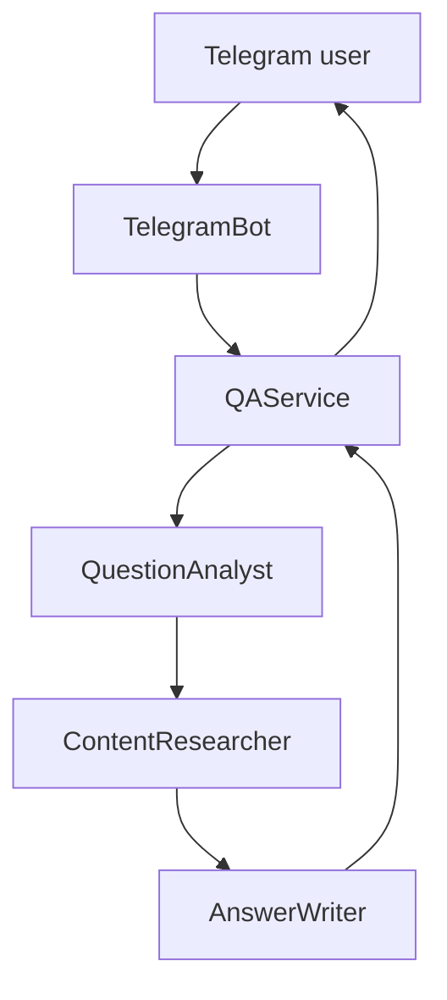

# crewai-telegram-rag-bot

This project implements a Telegram bot that answers questions using Retrieval-Augmented Generation (RAG) powered by CrewAI. The bot uses a vector store based on FAISS and the OpenAI API to generate responses.

## Purpose
The goal of this bot is to provide a lightweight example of how agent-driven RAG can be embedded in a simple chat interface. It ingests a document, indexes it with FAISS, and then allows users to query that document through Telegram. Answers are composed by a small set of autonomous agents working together.

## Agent Architecture
The application follows a layered architecture where the `QAService` coordinates three CrewAI agents:

1. **QuestionAnalyst** – examines the user's question and extracts the main topics.
2. **ContentResearcher** – searches the FAISS index for document snippets related to those topics using a `DocumentSearchTool`.
3. **AnswerWriter** – generates the final reply using the retrieved snippets and an OpenAI model.

These agents are orchestrated as CrewAI tasks so that each stage feeds into the next. The Telegram bot adapter simply forwards incoming messages to this service.

### Architecture Diagram


See `AGENTS.md` for contributor guidelines.

## Setup
1. Install dependencies:
```bash
pip install -r requirements.txt
```
2. Create a `.env` file based on `.env.example` and provide your tokens. This
   file is ignored by Git. Set `OPENAI_API_KEY` and optionally `OPENAI_API_BASE`
   if using a custom endpoint. `CREW_VERBOSE` controls whether CrewAI prints
   progress (default `True`). If ingestion fails with a 404 error, verify that
   `OPENAI_API_BASE` matches the provider URL.
3. Build the index by running the ingestion script:
```bash
python scripts/ingest_document.py
```
   This reads `data/documento.txt` and writes the FAISS index to
   `vector_store/faiss_index`. Edit `scripts/ingest_document.py` if you
   want to use different paths.
4. Start the bot (the index is loaded with `allow_dangerous_deserialization`
   because it is created locally):
```bash
python -m app.main
```
5. Open Telegram, search for your bot's name and send the `/start` command.
   Then type your questions as text messages to receive the RAG-powered answers.

Run tests with `pytest -q`.
